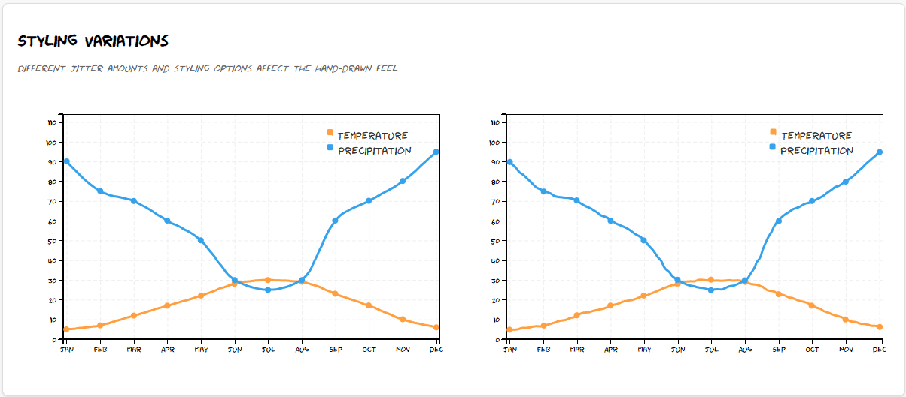
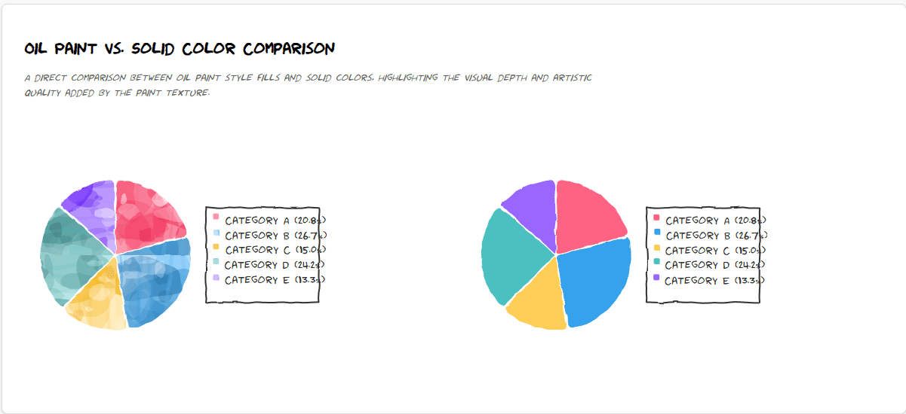

# Handwritten Graph Library

## Overview

A simple JavaScript library to create hand-drawn style charts inspired by comics and sketches. Built with D3.js, this library provides an easy-to-use API to generate fun, informal-looking graphs with customizable colors, labels, and data points.

### Example

Here’s some example of a graph generated with this library:

#### Line charts



#### Pie charts



## Features

- Hand-drawn/sketched visual style
- Line graphs with multi-series support
- Pie charts with interactive segments
- Donut chart option
- Directional scribble and oil paint texture fill patterns
- Tooltips with hover effects
- Legend customization
- Configurable hand-drawn effect

## Installation

Install via npm:

```bash
npm install handwritten-graphs
```

Alternatively, you can use the library via CDN.

```html
<script src="https://unpkg.com/handwritten-linegraph@0.1.3/dist/handwritten-graph.js"></script>
```

## Usage

### Line Graph

```javascript
// Data format for line graphs
const lineData = {
  labels: ["Jan", "Feb", "Mar", "Apr", "May", "Jun", "Jul"],
  datasets: [
    {
      label: "Revenue",
      data: [65, 59, 80, 81, 56, 55, 40],
      lineColor: "rgb(75, 192, 192)"
    },
    {
      label: "Expenses",
      data: [30, 45, 51, 60, 48, 40, 35],
      lineColor: "rgb(255, 99, 132)"
    }
  ]
};

// Create a line graph
HandwrittenGraph.createGraph("#graph-container", lineData, {
  width: 800,
  height: 400,
  handDrawnEffect: true
});
```

### Pie Chart

```javascript
// Data format for pie charts
const pieData = [
  { label: "Marketing", value: 30, color: "#FF6384" },
  { label: "Development", value: 45, color: "#36A2EB" },
  { label: "Research", value: 15, color: "#FFCE56" },
  { label: "Administration", value: 10, color: "#4BC0C0" }
];

// Create a pie chart
HandwrittenGraph.createPieChart("#pie-chart-container", pieData);

// Create a donut chart
HandwrittenGraph.createPieChart("#donut-chart-container", pieData, {
  innerRadius: 80 // Setting innerRadius > 0 creates a donut chart
});

// Create a pie chart with directional scribble fills
HandwrittenGraph.createPieChart("#scribble-pie-chart", pieData, {
  useScribbleFill: true,
  fillStyle: 'directional' // Use directional scribble lines
});

// Create a pie chart with oil paint texture fills (no scribble lines)
HandwrittenGraph.createPieChart("#oilpaint-pie-chart", pieData, {
  useScribbleFill: true,
  fillStyle: 'oilpaint' // Use rich layered paint texture effect
});
```

## Configuration Options

### Line Graph Options

| Option | Type | Default | Description |
|--------|------|---------|-------------|
| width | Number | 960 | Chart width in pixels |
| height | Number | 500 | Chart height in pixels |
| margin | Object | { top: 10, right: 10, bottom: 40, left: 50 } | Chart margins |
| jitter | Number | 1.9 | Amount of jitter for hand-drawn effect |
| lineColor | String | 'steelblue' | Default line color (can be overridden in dataset) |
| pointRadius | Number | 4 | Radius of data points |
| fontFamily | String | 'xkcd' | Font family for text elements |
| handDrawnEffect | Boolean | true | Enable/disable hand-drawn styling |
| legendBorder | Boolean | false | Show border around legend |
| Jitter | Number | 2 | Amount of jitter for hand-drawn effect |
| valueFormat | Function | d3.format('.1f') | Format function for values in tooltip |

## Browser Support

This library works in all modern browsers that support SVG and ES6.

## Development

### Setup

To install dependencies:

```sh
npm install
```

### Building the Project

To build the project:

```sh
npm run build
```

## License

MIT
