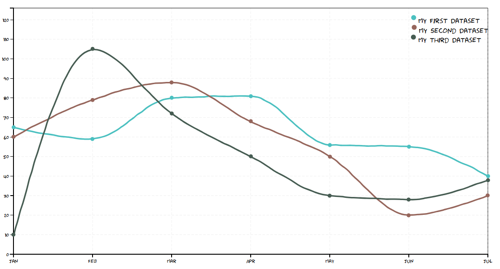

# Handwritten Graph Library

## Overview

A simple JavaScript library for creating handwritten-style line graphs using D3.js. This library provides an easy-to-use API to generate fun, informal-looking graphs with customizable colors, labels, and data points.

Here’s an example of a graph generated with this library:



## Installation

Install via npm:

```sh
npm install handwritten-linegraph
```

Alternatively, include the compiled JavaScript file in your project.

### Prerequisites

Make sure you have Node.js and npm installed before proceeding.

## Usage

### Import and Initialize

```javascript
import { createGraph } from 'handwritten-graph';

const data = {
  labels: ['Jan', 'Feb', 'Mar', 'Apr', 'May', 'Jun', 'Jul'],
  datasets: [{
    label: 'Sales',
    data: [65, 59, 80, 81, 56, 55, 40],
    lineColor: 'rgb(75, 192, 192)',
    pointColor: 'rgb(75, 192, 192)',
    pointRadius: 5,
    jitter: 0.1
  }]
};

createGraph('#graph-container', data);
```

Alternatively, include it in an HTML file:

```html
<!DOCTYPE html>
<html lang="en">
<head>
    <meta charset="UTF-8">
    <meta name="viewport" content="width=device-width, initial-scale=1.0">
    <title>Handwritten Graph Example</title>
</head>
<body>
    <div id="graph-container"></div>
    <script src="dist/bundle.js"></script>
    <script>
        const data = {
            labels: ['Jan', 'Feb', 'Mar', 'Apr', 'May', 'Jun', 'Jul'],
            datasets: [{
                label: 'Sales',
                data: [65, 59, 80, 81, 56, 55, 40],
                lineColor: 'rgb(75, 192, 192)',
                pointColor: 'rgb(75, 192, 192)',
                pointRadius: 5,
                jitter: 0.1
            }]
        };
        HandwrittenGraph.createGraph('#graph-container', data);
    </script>
</body>
</html>
```

## API Methods

### `createGraph(selector, data, config)`

Creates a handwritten-style line graph inside the specified container.

#### Parameters

- `selector` (**string**) - A CSS selector for the container where the graph should be created.
- `data` (**object**) - The dataset used to draw the graph.
- `config` (**object**, optional) - Additional configuration options for the graph.

#### Updated Data Structure

```javascript
const data = {
  labels: ['Jan', 'Feb', 'Mar', 'Apr', 'May', 'Jun', 'Jul'],
  datasets: [{
    label: 'Sales',
    data: [65, 59, 80, 81, 56, 55, 40],
    lineColor: 'rgb(75, 192, 192)',
    pointColor: 'rgb(75, 192, 192)',
    pointRadius: 5,
    jitter: 0.1
  }]
};
```

#### Config Options

| Option       | Type      | Default | Description |
|-------------|----------|---------|-------------|
| `width`     | number   | `960`   | Width of the graph in pixels. |
| `height`    | number   | `500`   | Height of the graph in pixels. |
| `margin`    | object   | `{ top: 10, right: 10, bottom: 40, left: 50 }` | Margins around the graph. |
| `jitter`    | number   | `1.9`   | Adds randomness for a hand-drawn effect. |
| `pointRadius` | number  | `4`   | Radius of data point dots. |

#### Example

```javascript
createGraph('#graph-container', data, {
  width: 800,
  height: 400,
  pointRadius: 5
});
```

## Development

### Setup

To install dependencies:

```sh
npm install
```

### Building the Project

To build the project:

```sh
npm run build
```

## License

MIT License
